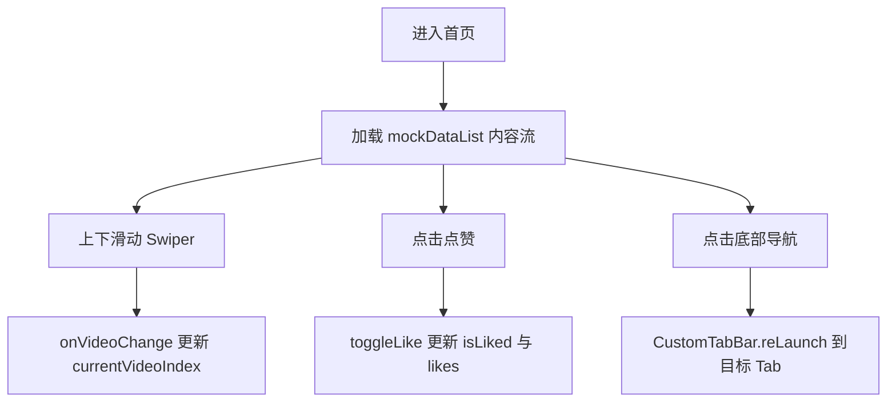
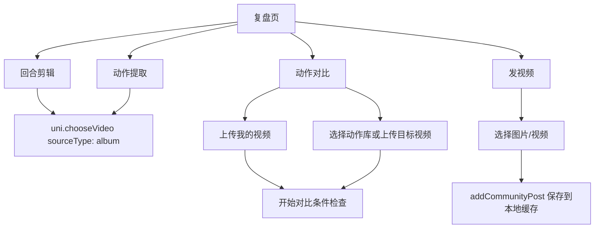
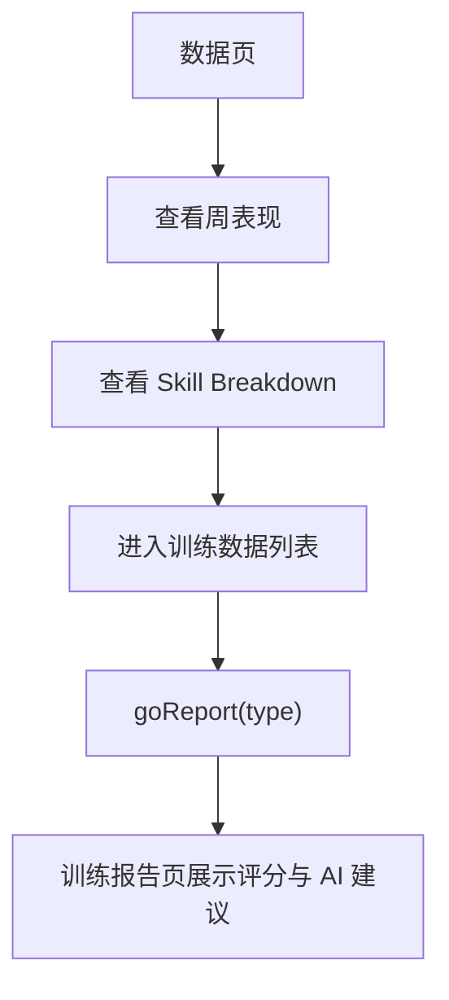
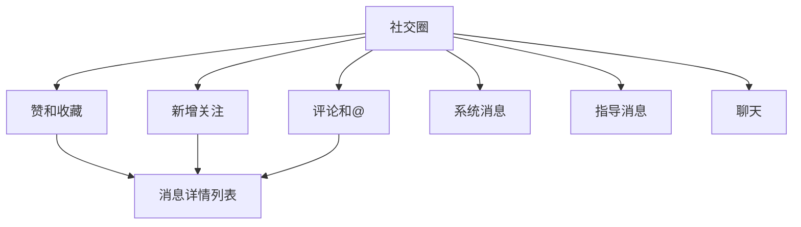
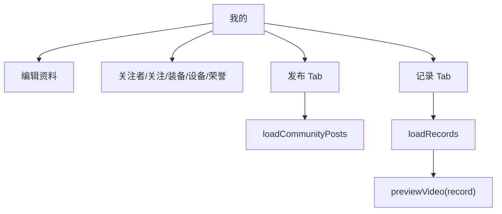

# CourtVision 技术参考与使用手册

本文档面向 CourtVision 项目的开发者、测试人员和内部体验用户，说明核心页面、交互流程、关键函数与集成方式。项目基于 Vue.js 与 uni-app 构建，主要运行于移动端 App 环境。

## 1. 核心模块概览

| 模块 | 主要页面 | 入口路径 | 核心能力 | 主要代码位置 |
| --- | --- | --- | --- | --- |
| 首页 | 短视频/内容流首页 | `/pages/tabbar/index/index` | 上下滑动内容流、点赞、顶部推荐/关注切换、播放进度模拟 | `pages/tabbar/index/index.vue` |
| 复盘/技术工坊 | AI 教练、回合剪辑、动作提取、动作对比、发布内容 | `/pages/tabbar/ai-coach-select/ai-coach-select` | 技术功能入口、相册视频选择、动作库对比、图片/视频发布 | `pages/tabbar/ai-coach-select/ai-coach-select.vue` |
| 数据分析 | 训练数据、训练报告、成就墙 | `/pages/tabbar/data/data` | 周训练表现、技能分布、报告详情、成就勋章 | `pages/tabbar/data/data.vue`, `pages/stats/report/report.vue` |
| 社交 | 消息中心、赞和收藏、新增关注、评论、系统消息、聊天 | `/pages/tabbar/record/record` | 消息聚合、消息分类跳转、社交通知与指导消息 | `pages/tabbar/record/record.vue`, `pages/messages/*` |
| 个人设置 | 我的、编辑资料、关注者、关注、装备、智能设备 | `/pages/tabbar/profile/profile` | 个人资料、发布列表、本地训练记录、装备与设备页 | `pages/tabbar/profile/profile.vue`, `pages/profile/*` |

## 2. 页面交互说明

### 2.1 首页

**操作流程指引**

1. 进入首页后，内容流以全屏卡片形式展示。
2. 上下滑动 `swiper` 切换当前内容。
3. 点击右侧点赞按钮可切换点赞状态，并更新点赞数量。
4. 顶部 `Following / For You` 用于切换内容分类状态。
5. 底部导航栏可跳转到社交圈、复盘、数据、我的。



**视觉引导逻辑**

- 首页使用黑色全屏背景，内容图片/视频占据视觉主体。
- 顶部栏目使用半透明渐变和轻微毛玻璃效果，让分类切换与内容层分离。
- 右侧互动区采用半透明深色面板，降低遮挡感。
- 底部导航使用荧光黄绿色作为激活状态，强调当前主功能路径。

### 2.2 复盘/技术工坊

**操作流程指引**

1. 点击底部“复盘”进入技术工坊。
2. 点击“AI 教练助手”进入 AI 教练选择页。
3. 点击“回合剪辑”进入剪辑页，选择相册视频后开始后续处理。
4. 点击“动作提取”进入动作提取页，选择相册视频作为分析素材。
5. 点击“动作对比”进入对比页，上传我的视频，并选择动作库动作或上传目标视频。
6. 点击“发视频”进入发布页，选择图片/视频并发布到“我的-发布”列表。



**视觉引导逻辑**

- 技术工坊采用黑底和荧光绿描边卡片，表示可点击工具入口。
- 上传按钮采用深色卡片加图标，降低干扰。
- AI 提示卡使用绿色渐变背景，提示系统自动识别/智能分析能力。
- 禁用按钮使用低对比灰色，表示条件未满足。

### 2.3 数据分析

**操作流程指引**

1. 点击底部“数据”进入数据页。
2. 查看周训练次数、总时长、平均评分。
3. 查看技能分布卡片，包括发球、正手、反手等指标。
4. 在训练数据详情页点击具体训练项，可进入训练报告页面。
5. 在“我的-荣誉勋章”查看成就解锁进度。



**视觉引导逻辑**

- 数据页使用卡片化布局，将汇总指标和技能指标分区。
- 进度条使用荧光绿强化“完成度”和“成绩提升”。
- 报告页使用大号评分和指标网格，快速建立数据层级。

### 2.4 社交

**操作流程指引**

1. 点击底部“社交圈”进入消息中心。
2. 顶部三个快捷入口分别进入“赞和收藏”“新增关注”“评论和@”。
3. 下方消息卡片可进入“系统消息”“指导消息”“聊天”。
4. 底部图片卡可进入指导消息，作为运营/课程入口。



**视觉引导逻辑**

- 社交页顶部使用头像、品牌名和通知点建立消息中心语境。
- 快捷入口使用圆形深绿背景和 CSS 图标，表达轻量入口。
- 消息列表使用深色卡片，标题高亮、描述弱化，方便快速扫描。

### 2.5 我的/个人设置

**操作流程指引**

1. 点击底部“我的”进入个人主页。
2. 点击“编辑”进入编辑个人资料页。
3. 点击关注者、关注中、荣誉勋章、装备、智能设备进入对应详情页。
4. 在“发布”tab 查看发布的图片/视频内容。
5. 在“记录”tab 查看本地保存的训练视频记录。
6. 点击“立即拍摄”或发布入口进入发布/上传流程。



**视觉引导逻辑**

- 个人页以头像光环和统计卡片建立个人中心层级。
- 当前 tab 使用荧光绿下划线。
- 空状态使用居中提示和主按钮，引导用户发布或上传。

## 3. 关键函数 API 参考

### 3.1 首页模块

#### `onVideoChange`

```js
const onVideoChange = (e) => void
```

| 项 | 说明 |
| --- | --- |
| 参数 | `e.detail.current`: 当前 swiper 索引 |
| 返回值 | 无 |
| 功能 | 在内容流滑动切换时更新 `currentVideoIndex`，并重置进度百分比。 |

#### `toggleLike`

```js
const toggleLike = (item) => void
```

| 项 | 说明 |
| --- | --- |
| 参数 | `item`: 当前内容项，包含 `isLiked` 与 `likes` |
| 返回值 | 无 |
| 功能 | 切换点赞状态，并同步增减点赞数。 |

#### `startProgress` / `stopProgress`

```js
const startProgress = () => void
const stopProgress = () => void
```

| 项 | 说明 |
| --- | --- |
| 参数 | 无 |
| 返回值 | 无 |
| 功能 | 启动或停止首页内容播放进度模拟定时器。 |

### 3.2 导航模块

#### `switchTab`

```js
const switchTab = (item) => void
```

| 项 | 说明 |
| --- | --- |
| 参数 | `item.path` 或 `item.pagePath`: 目标页面路径 |
| 返回值 | 无 |
| 功能 | 底部导航切换页面，使用 `uni.reLaunch` 保证 Tab 页面状态刷新。 |

#### `getCurrentPageIndex`

```js
const getCurrentPageIndex = () => number
```

| 项 | 说明 |
| --- | --- |
| 参数 | 无 |
| 返回值 | 当前页面在 `tabList` 中的索引；未匹配时返回 `0` |
| 功能 | 通过 `getCurrentPages()` 获取当前路由，并设置底部导航激活态。 |

### 3.3 复盘/视频处理模块

#### `selectVideo`

```js
const selectVideo = () => void
```

| 项 | 说明 |
| --- | --- |
| 参数 | 无 |
| 返回值 | 无 |
| 功能 | 在回合剪辑、动作提取页面调用 `uni.chooseVideo({ sourceType: ['album'] })`，从相册选择视频。 |

#### `pickVideo`

```js
const pickVideo = () => Promise<UniApp.ChooseVideoSuccess | null>
```

| 项 | 说明 |
| --- | --- |
| 参数 | 无 |
| 返回值 | 成功时返回视频选择结果；取消或失败返回 `null` |
| 功能 | 动作对比页的通用相册视频选择封装。 |

#### `uploadMyVideo`

```js
const uploadMyVideo = async () => Promise<void>
```

| 项 | 说明 |
| --- | --- |
| 参数 | 无 |
| 返回值 | `Promise<void>` |
| 功能 | 为动作对比页上传“我的视频”，保存临时路径和文件名。 |

#### `uploadTargetVideo`

```js
const uploadTargetVideo = async () => Promise<void>
```

| 项 | 说明 |
| --- | --- |
| 参数 | 无 |
| 返回值 | `Promise<void>` |
| 功能 | 上传对比目标视频，并清空已选动作库目标。 |

#### `chooseAction`

```js
const chooseAction = (item) => void
```

| 项 | 说明 |
| --- | --- |
| 参数 | `item`: 动作库条目，包含 `id/name/desc/level/icon` |
| 返回值 | 无 |
| 功能 | 从虚构动作库选择标准动作作为对比目标，并清空目标视频。 |

#### `startCompare`

```js
const startCompare = () => void
```

| 项 | 说明 |
| --- | --- |
| 参数 | 无 |
| 返回值 | 无 |
| 功能 | 检查“我的视频”和“对比目标”是否齐备，满足条件后触发对比提示。 |

### 3.4 发布与本地缓存模块

#### `chooseImage` / `chooseVideo`

```js
const chooseImage = () => void
const chooseVideo = () => void
```

| 项 | 说明 |
| --- | --- |
| 参数 | 无 |
| 返回值 | 无 |
| 功能 | 发布页选择图片或视频，写入 `selectedMedia`。 |

#### `publishPost`

```js
const publishPost = async () => Promise<void>
```

| 项 | 说明 |
| --- | --- |
| 参数 | 无 |
| 返回值 | `Promise<void>` |
| 功能 | 将已选媒体保存为本地持久文件，并通过 `addCommunityPost` 写入本地发布列表。 |

#### `getCommunityPosts`

```js
export const getCommunityPosts = () => Array
```

| 项 | 说明 |
| --- | --- |
| 参数 | 无 |
| 返回值 | 本地发布内容数组 |
| 功能 | 从 `uni.getStorageSync('courtvision_community_posts')` 读取发布列表。 |

#### `addCommunityPost`

```js
export const addCommunityPost = (post) => object
```

| 项 | 说明 |
| --- | --- |
| 参数 | `post`: 发布内容对象，包含 `type/src/text/tags/likes/comments` |
| 返回值 | 带 `id` 与 `createdAt` 的新发布对象 |
| 功能 | 将新发布内容插入本地缓存列表头部。 |

#### `saveLocalFile`

```js
export const saveLocalFile = (tempFilePath) => Promise<string>
```

| 项 | 说明 |
| --- | --- |
| 参数 | `tempFilePath`: 临时文件路径 |
| 返回值 | 成功保存后的本地路径；失败则返回原临时路径 |
| 功能 | 使用 `uni.saveFile` 尽量持久化用户选择的媒体文件。 |

### 3.5 训练记录模块

#### `getVideoRecords`

```js
export const getVideoRecords = () => Array
```

| 项 | 说明 |
| --- | --- |
| 参数 | 无 |
| 返回值 | 本地训练视频记录数组 |
| 功能 | 从 `uni.getStorageSync('courtvision_video_records')` 读取训练记录。 |

#### `addVideoRecord`

```js
export const addVideoRecord = (record) => object
```

| 项 | 说明 |
| --- | --- |
| 参数 | `record`: 视频记录对象，包含 `src/title/duration/size` 等 |
| 返回值 | 带 `id` 与 `createdAt` 的新记录 |
| 功能 | 将训练视频记录保存到本地缓存。 |

#### `saveLocalVideo`

```js
export const saveLocalVideo = (tempFilePath) => Promise<string>
```

| 项 | 说明 |
| --- | --- |
| 参数 | `tempFilePath`: 临时视频路径 |
| 返回值 | 保存后的路径或原路径 |
| 功能 | 将临时视频文件保存为本地持久文件。 |

### 3.6 数据分析模块

#### `goReport`

```js
goReport(type)
```

| 项 | 说明 |
| --- | --- |
| 参数 | `type`: 训练类型，如 `发球训练`、`正手击球` |
| 返回值 | 无 |
| 功能 | 跳转到训练报告页，并通过 query 参数传入报告类型。 |

### 3.7 社交模块

#### `goMessagePage`

```js
const goMessagePage = (url) => void
```

| 项 | 说明 |
| --- | --- |
| 参数 | `url`: 消息详情页路径 |
| 返回值 | 无 |
| 功能 | 社交圈消息入口统一跳转函数。 |

#### `toggleFollow`

```js
const toggleFollow = (item) => void
```

| 项 | 说明 |
| --- | --- |
| 参数 | `item`: 关注消息对象，包含 `followed` |
| 返回值 | 无 |
| 功能 | 在新增关注页切换回关/相互关注状态。 |

### 3.8 个人中心模块

#### `loadCommunityPosts`

```js
const loadCommunityPosts = () => void
```

| 项 | 说明 |
| --- | --- |
| 参数 | 无 |
| 返回值 | 无 |
| 功能 | 在“我的-发布”tab 中读取本地发布内容并格式化日期。 |

#### `loadRecords`

```js
const loadRecords = () => void
```

| 项 | 说明 |
| --- | --- |
| 参数 | 无 |
| 返回值 | 无 |
| 功能 | 在“我的-记录”tab 中读取本地训练视频记录。 |

#### `previewVideo`

```js
const previewVideo = (record) => void
```

| 项 | 说明 |
| --- | --- |
| 参数 | `record`: 视频记录对象，包含 `src/title` |
| 返回值 | 无 |
| 功能 | 跳转到视频预览页并传入视频路径与标题。 |

#### `saveProfile`

```js
const saveProfile = () => void
```

| 项 | 说明 |
| --- | --- |
| 参数 | 无 |
| 返回值 | 无 |
| 功能 | 编辑个人资料页保存当前表单状态，并返回上一页。 |

## 4. 开发与集成指引

### 4.1 开发环境配置

1. 安装 HBuilderX，并确保支持 uni-app 项目运行。
2. 使用 HBuilderX 打开项目根目录。
3. 安装并启动 Android 模拟器，例如 MuMu 模拟器。
4. 在 HBuilderX 中选择“运行到 Android App 基座”。
5. 若需要测试图片/视频选择，请先向模拟器相册导入测试素材。

推荐目录约定：

```text
components/        通用组件，如 Layout、底部导航
pages/tabbar/      主要 Tab 页面
pages/training/    训练工具页
pages/messages/    消息详情页
pages/profile/     个人中心相关页
utils/             本地缓存、文件保存等工具函数
static/            本地图片、视频、图标资源
```

### 4.2 新增页面的基本步骤

1. 在 `pages/` 下创建页面目录和 `.vue` 文件。
2. 在 `pages.json` 中注册页面路径。
3. 在入口页中使用 `uni.navigateTo` 或底部导航使用 `uni.reLaunch` 跳转。
4. 如需要底部导航，普通子页面可引入 `AppBottomNav`，主技术页可使用 `Layout`。

### 4.3 新页面增加导航功能示例

#### 注册页面

```json
{
  "path": "pages/example/demo/demo",
  "style": {
    "navigationBarTitleText": "示例页面",
    "navigationStyle": "custom"
  }
}
```

#### 页面内跳转

```vue
<template>
  <view class="card" @tap="goDemo">
    <text>打开示例页面</text>
  </view>
</template>

<script setup>
const goDemo = () => {
  uni.navigateTo({
    url: '/pages/example/demo/demo'
  })
}
</script>
```

#### 增加底部导航项

如需新增主 Tab，更新 `components/AppBottomNav/AppBottomNav.vue` 或 `components/CustomTabBar/CustomTabBar.vue` 中的 `tabList`：

```js
const tabList = [
  { key: 'home', label: '首页', path: '/pages/tabbar/index/index', icon: '/static/coach/首页.png' },
  { key: 'record', label: '社交圈', path: '/pages/tabbar/record/record', icon: '/static/coach/社交圈白.png' },
  { key: 'review', label: '复盘', path: '/pages/tabbar/ai-coach-select/ai-coach-select', icon: '' },
  { key: 'data', label: '数据', path: '/pages/tabbar/data/data', icon: '/static/coach/数据白.png' },
  { key: 'profile', label: '我的', path: '/pages/tabbar/profile/profile', icon: '/static/coach/我的.png' }
]
```

### 4.4 运动分析接口集成建议

当前项目中的动作提取、动作对比、训练报告多为本地 mock 或页面级交互。后续接入真实 AI 服务时，建议抽象为独立 API 层：

```js
export const analyzeMotion = async ({ videoPath, mode, targetActionId }) => {
  // 1. 上传视频到后端或对象存储
  // 2. 创建分析任务
  // 3. 轮询任务状态
  // 4. 返回骨骼点、评分、建议、热区等结构化结果
}
```

建议返回结构：

```js
{
  taskId: 'motion_001',
  status: 'completed',
  score: 89,
  keypoints: [],
  highlights: [],
  suggestions: [
    '保持击球前的重心稳定',
    '提高随挥完整度'
  ]
}
```

### 4.5 维护建议

- 统一使用 `@tap` 处理移动端点击。
- App 端涉及原生视频层时，优先使用 `cover-view` 或避免普通元素覆盖原生视频。
- 底部导航尺寸由公共组件维护，避免在页面内重复实现。
- 本地缓存统一放在 `utils/` 下封装，避免页面直接散落 `uni.setStorageSync`。
- 新增页面后执行两项检查：

```bash
# 检查 pages.json 中注册页面是否存在
node -e "const fs=require('fs'); const p=JSON.parse(fs.readFileSync('pages.json','utf8')); for (const x of p.pages) if(!fs.existsSync(x.path+'.vue')) console.log('MISSING '+x.path)"

# 检查 pages 下是否有未注册页面
node -e "const fs=require('fs'), path=require('path'); const p=JSON.parse(fs.readFileSync('pages.json','utf8')); const routes=new Set(p.pages.map(x=>x.path)); function walk(d,out=[]){ for(const e of fs.readdirSync(d,{withFileTypes:true})){ const fp=path.join(d,e.name); if(e.isDirectory()) walk(fp,out); else if(e.name.endsWith('.vue')) out.push(fp.replace(/\\\\/g,'/').replace(/\\.vue$/,'')); } return out;} walk('pages').filter(f=>!routes.has(f)).forEach(f=>console.log('UNREGISTERED '+f));"
```
